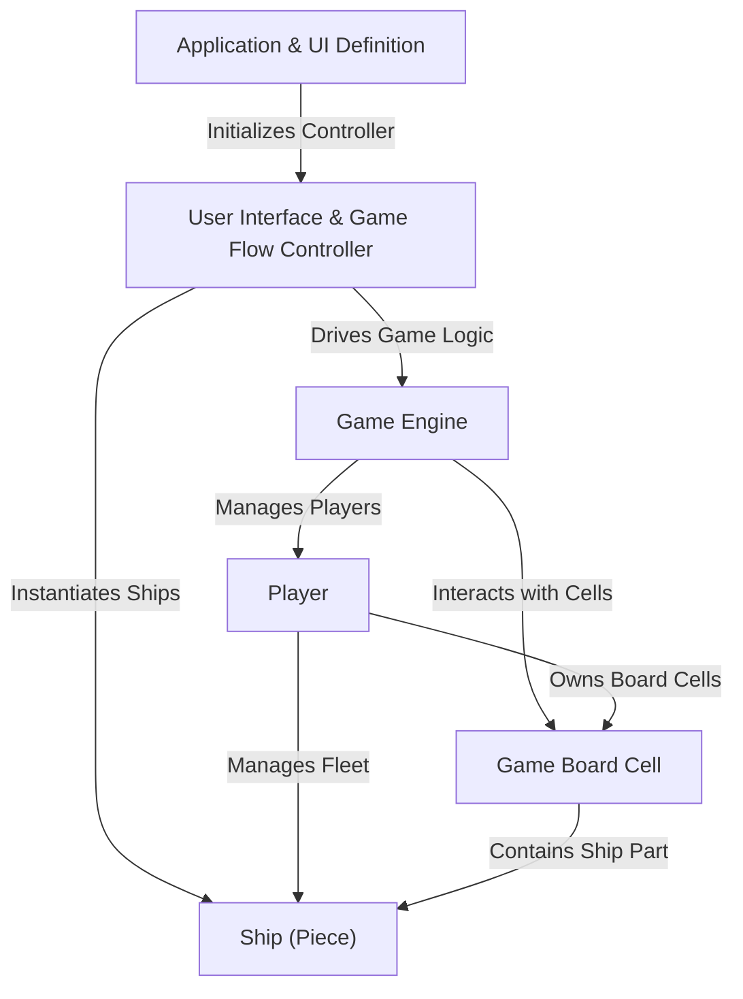
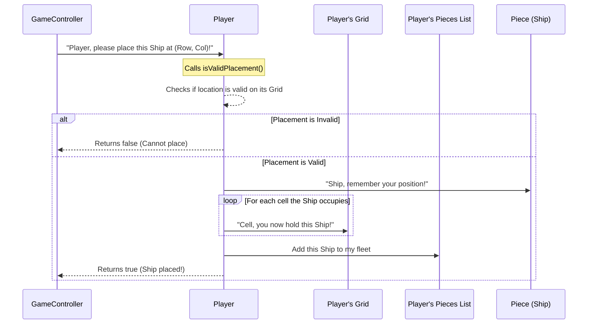
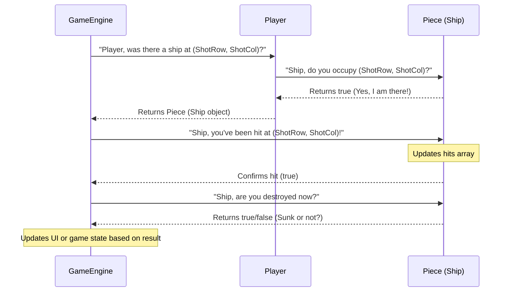
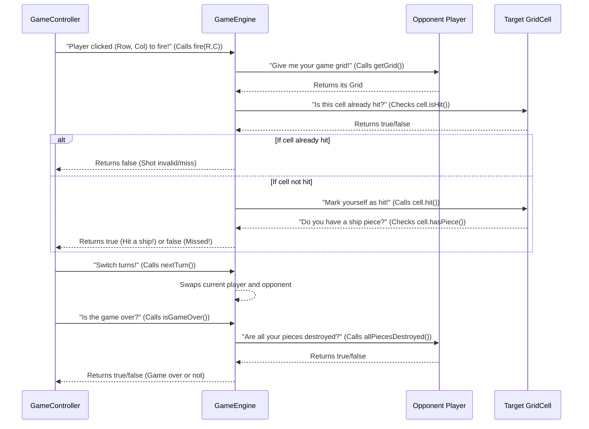
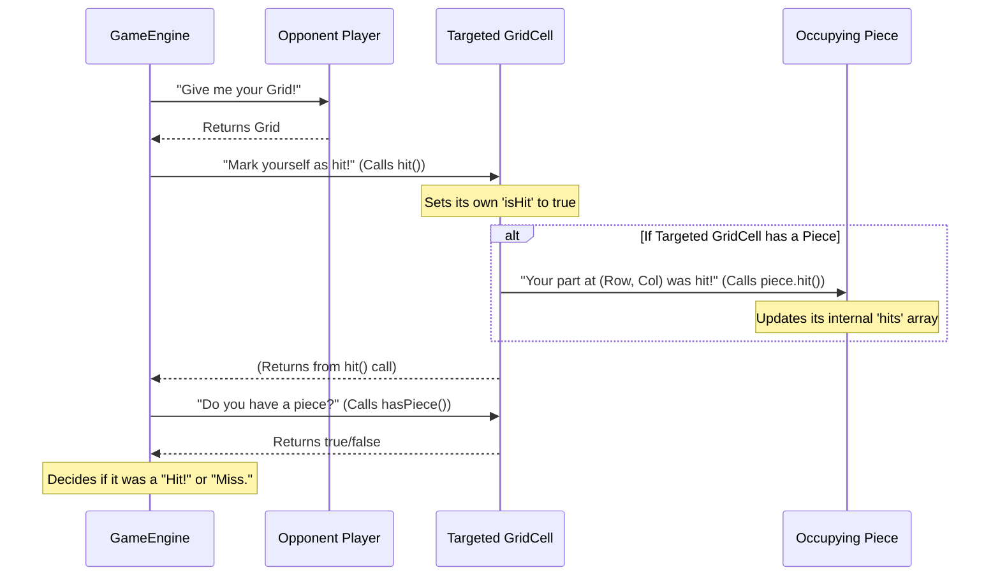

# 🚢 Battleship 

Battleship is a **Java-based implementation** of the classic strategy game where players attempt to sink each other's hidden fleet.  
This version features **player-vs-computer gameplay**, **interactive ship placement**, and a **clean terminal-based interface**.

---

## Features:
- **Classic Battleship gameplay** with 5 ships (Carrier, Battleship, Cruiser, Submarine, Destroyer)
- **Interactive ship placement** (manual or random)
- **Real-time feedback** on hits, misses, and ship status
- **Score tracking** across multiple games
- **Built with Java** for cross-platform compatibility
- **Maven-based** build system for easy compilation

---

## 🖥️ Game Screenshots

<table>
  <tr>
    <td align="center">
      <br>
      <em>Ship Placement Screen</em>
    </td>
    <td align="center">
      <br>
      <em>Gameplay Screen</em>
    </td>
    <td align="center">
      <br>
      <em>Victory Screen</em>
    </td>
  </tr>
</table>

---
</pre> <hr> <h2>📂 File Structure</h2> 
   <pre>
└── ishraqgit-battleship/
    ├── README.md
    ├── command.txt
    ├── bin/
    │   ├── Main.fxml
    │   └── battleship/
    │       └── Main.fxml
    ├── Resource/
    └── src/
        ├── App.java
        └── battleship/
            ├── App.java
            ├── Battleship.java
            ├── Destroyer.java
            ├── Game.java
            ├── GameController.java
            ├── GridCell.java
            ├── Main.fxml
            ├── Piece.java
            ├── Player.java
            └── Submarine.java
        └── wrapper/
            └── maven-wrapper.properties 
   </pre> <hr> <h2>

## Game Components

### 1️⃣ Main Game Loop
The `Game` class manages the core gameplay loop, alternating between player and computer turns until victory conditions are met.

**Key features:**
- Turn management
- Victory condition checking
- Game state persistence
- Score tracking

### 2️⃣ Board Management
The `Board` class handles all grid-related operations:

**Functionality:**
- Ship placement validation
- Attack coordinate processing
- Board rendering (text-based)
- Hit/miss tracking

### 3️⃣ Mutiplayer features
Each `Player` classes handle respective moves:

**Player:**
- Interactive ship placement
- Coordinate input validation
- Attack selection

### 4️⃣ Ship System
The `Ship` class represents naval units:

**Attributes:**
- Ship type (size, name)
- Health tracking
- Position/orientation
- Sink detection

---

<h2>⚙️ How to Use</h2>
<h3>Prerequisites</h3>
<ul>
  <li>Java <strong>JDK 17+</strong></li>
  <li>JavaFX SDK installed (e.g., <code>javafx-sdk-24.0.2</code>)</li>
  <li>Maven installed (optional but recommended)</li>
  <li>Compatible IDE (IntelliJ IDEA, Eclipse, VS Code) or terminal access</li>
</ul>

<h3>Setup & Running</h3>
<ol>
  <li>Clone the repository:
<pre><code>git clone https://github.com/IshraqGit/BATTLESHIP.git
cd BATTLESHIP</code></pre></li>

  <li>Build the project with Maven:
<pre><code>mvn clean install</code></pre></li>

  <li>Run the application with Maven:
<pre><code>mvn javafx:run</code></pre></li>

  <li><strong>Without Maven (direct JavaFX run):</strong>
<pre><code>set JAVAFX_HOME=C:\Java\javafx-sdk-24.0.2
javac --module-path "%JAVAFX_HOME%\lib" --add-modules javafx.controls,javafx.fxml ^
      -d bin src\main\java\battleship\**\*.java

java --module-path "%JAVAFX_HOME%\lib" --add-modules javafx.controls,javafx.fxml ^
     -cp "bin" battleship.App
</code></pre></li>
</ol>

<hr>
<h2>🛠️ Contributing</h2>
<p>Contributions are welcome! Follow the steps below to contribute:</p>
<ol>
  <li>Fork the repository</li>
  <li>Create a new branch:
<pre><code>git checkout -b feature-name</code></pre></li>

  <li>Commit your changes:
<pre><code>git commit -m "Add some feature"</code></pre></li>

  <li>Push the branch:
<pre><code>git push origin feature-name</code></pre></li>

  <li>Open a pull request</li>
</ol>

<hr>

</body>
</html>


# Tutorial: BATTLESHIP

This project builds a digital **Battleship** game where two *players* engage in naval combat. The game allows players to first *place their ships* on a hidden grid and then take turns *firing shots* at their opponent's board. The system tracks hits and misses, determines when ships are sunk, and declares a winner when one player successfully destroys all of the other's fleet.


## Visual Overview



## Chapters

1. [Application & UI Definition
](01_application___ui_definition_.md)
2. [User Interface & Game Flow Controller
](02_user_interface___game_flow_controller_.md)
3. [Player
](03_player_.md)
4. [Ship (Piece)
](04_ship__piece__.md)
5. [Game Engine
](05_game_engine_.md)
6. [Game Board Cell
](06_game_board_cell_.md)

---

# Chapter 1: Application & UI Definition

Imagine you're building a house. Before you can even think about the furniture, the kitchen, or the bedrooms, you need two fundamental things: a **solid foundation** to build upon, and a **detailed architectural blueprint** that shows where every wall, window, and door will go.

In our Battleship game, `App.java` and `Main.fxml` play exactly these roles! They are the very first pieces of our project that bring the game to life on your screen.

**The big problem they solve:** How do we make a window appear on your computer screen and fill it with all the buttons, text boxes, and game boards that make up our Battleship game? This chapter will guide you through how `App.java` acts as the "foundation" and `Main.fxml` serves as the "blueprint" to achieve this.

---

### Understanding the Core Concepts

Our game uses a technology called **JavaFX** to create beautiful graphical user interfaces (GUIs). Think of JavaFX as a special set of tools and rules for drawing things on your screen.

To make a JavaFX application work, we primarily use two types of files for this initial setup:

1.  **`App.java`:** This is our application's main starting point. It's like the "on" switch for our game. When you run the game, `App.java` is the first file that gets executed. Its main job is to set up the basic window (what JavaFX calls a "Stage") and load the blueprint for what goes inside it.

2.  **`Main.fxml`:** This file is the "blueprint" of our game's main screen. FXML stands for **F**XML **M**arkup **L**anguage, and it's a special way to describe your user interface using text, much like how web pages are described using HTML. Instead of writing complex Java code to arrange every button and text field, we simply list them in this FXML file, and JavaFX knows how to draw them.

Let's see how they work together!

---

### How Our Game Window Appears

When you run our Battleship game, here's a simplified sequence of events:

1.  You (the user) start the `App.java` program.
2.  `App.java` tells JavaFX to get ready.
3.  JavaFX then looks for the `Main.fxml` file.
4.  It reads `Main.fxml` like a recipe, figuring out where all the labels, text fields, buttons, and game grids should be placed.
5.  Finally, JavaFX builds and displays the main game window on your screen according to that recipe!

Let's look at the code that makes this happen.

#### The `App.java` Foundation

First, let's examine `src/battleship/App.java`:

```java
package battleship;

import javafx.application.Application;
import javafx.fxml.FXMLLoader;
import javafx.scene.Parent;
import javafx.scene.Scene;
import javafx.stage.Stage;

public class App extends Application {
    @Override
    public void start(Stage primaryStage) throws Exception {
        // Line 1: Create a tool to load FXML files
        FXMLLoader loader = new FXMLLoader(getClass().getResource("Main.fxml"));
        // Line 2: Load the blueprint from Main.fxml
        Parent root = loader.load();
        // Line 3: Create the 'scene' (content inside the window)
        Scene scene = new Scene(root, 900, 700);
        // Line 4: Set the window's title
        primaryStage.setTitle("Battleship Game");
        // Line 5: Put the scene into the window
        primaryStage.setScene(scene);
        // Line 6: Show the window!
        primaryStage.show();
    }

    public static void main(String[] args) {
        // Line 7: This is where our JavaFX application truly starts
        launch(args);
    }
}
```

**Explanation:**

*   **`package battleship;`**: This simply means our `App.java` file belongs to the `battleship` group of files.
*   **`import javafx.application.Application;`**: We need to "import" special tools from JavaFX to build our application. Think of it like getting specific tools from a toolbox.
*   **`public class App extends Application { ... }`**: Our `App` class is special because it `extends Application`. This tells Java that our `App` is a JavaFX application.
*   **`public static void main(String[] args) { launch(args); }`**: This is the very first method that runs in any Java program. All it does here is tell JavaFX to start our application. JavaFX then takes over and automatically calls the `start` method.
*   **`public void start(Stage primaryStage) throws Exception { ... }`**: This `start` method is where the magic happens. JavaFX calls this method when it's ready to show your application window.
    *   **Line 1 & 2 (`FXMLLoader` and `loader.load()`):** This is the core part that reads `Main.fxml`. `FXMLLoader` is like an architect who reads the blueprint. `getClass().getResource("Main.fxml")` tells the architect *where* to find the blueprint file. `loader.load()` actually reads the file and builds all the UI elements (buttons, grids, etc.) into a `Parent` object (think of it as a big container for all our UI elements).
    *   **Line 3 (`new Scene(...)`):** A `Scene` is like the actual content or "play" that goes inside the `Stage` (our window). We put our `root` (all the UI elements from `Main.fxml`) into a new `Scene` and define its size (900 pixels wide, 700 pixels tall).
    *   **Line 4 & 5 (`primaryStage.setTitle(...)` and `primaryStage.setScene(...)`):** The `Stage` is the actual window itself. We give it a title ("Battleship Game") and then place our `scene` inside it.
    *   **Line 6 (`primaryStage.show();`):** This command finally makes the window visible on your screen!

#### The `Main.fxml` Blueprint

Now let's look at a small part of our `src/battleship/Main.fxml` file. This is the blueprint that `App.java` loads:

```xml
<?xml version="1.0" encoding="UTF-8"?>
<?import javafx.scene.control.*?>
<?import javafx.scene.layout.*?>
<!-- ... other imports ... -->

<StackPane xmlns:fx="http://javafx.com/fxml" fx:controller="battleship.GameController">
    <!-- This is our background image -->
    <ImageView fitWidth="900" fitHeight="700" preserveRatio="false" opacity="0.7">
        <image>
            <Image url="file:../Resource/cover.png" />
        </image>
    </ImageView>
    
    <!-- This is a vertical box to hold our game elements -->
    <VBox spacing="20" alignment="CENTER">
        <!-- Our game title -->
        <Label text="Battleship" style="-fx-font-size: 96;"/>
        
        <!-- Player Name Inputs -->
        <HBox spacing="20" alignment="CENTER">
            <VBox>
                <Label text="Player 1:"/>
                <TextField fx:id="player1NameField" promptText="Enter Player 1 name"/>
            </VBox>
            <VBox>
                <Label text="Player 2:"/>
                <TextField fx:id="player2NameField" promptText="Enter Player 2 name"/>
            </VBox>
            <Button text="Start Game" fx:id="startButton" onAction="#startGame"/>
        </HBox>
        
        <!-- ... more game elements like grids and buttons ... -->
        
    </VBox>
</StackPane>
```

**Explanation:**

*   **`<?xml version="1.0" encoding="UTF-8"?>`**: This is standard XML boilerplate, just indicating it's an XML file.
*   **`<?import javafx.scene.control.*?>`**: These lines are like saying "I'll be using controls like buttons and labels, and layouts like boxes."
*   **`<StackPane ...>`**: This is the very first container. A `StackPane` is useful because it stacks things on top of each other. Here, we put an `ImageView` (our background picture) and then a `VBox` (a vertical box) on top of it.
*   **`fx:controller="battleship.GameController"`**: This very important part tells JavaFX which Java class is responsible for handling events and logic for this screen. We'll learn more about `GameController` in the next chapter!
*   **`<ImageView ...>`**: This element displays an image. We're using `cover.png` as our background.
*   **`<VBox ...>`**: This is a "Vertical Box." It arranges all the elements inside it one below the other. `spacing` adds space between items, and `alignment="CENTER"` puts everything in the middle.
*   **`<Label text="Battleship" ...>`**: This displays simple text, like our game title or "Player 1:".
*   **`<HBox ...>`**: This is a "Horizontal Box." It arranges elements side-by-side. We use it here to put the two player name input fields and the "Start Game" button next to each other.
*   **`<TextField fx:id="player1NameField" promptText="Enter Player 1 name"/>`**: This creates a text box where players can type their names.
    *   **`fx:id="player1NameField"`**: This gives a unique ID (name) to this text field. This ID is super important because it allows our Java code (like the `GameController`) to find *this specific* text field and read what the player typed into it.
*   **`<Button text="Start Game" fx:id="startButton" onAction="#startGame"/>`**: This creates a clickable button.
    *   **`onAction="#startGame"`**: This tells the button: "When I'm clicked, go find a method named `startGame` in my `GameController` and run it!"

---

### Internal Implementation: A Step-by-Step Look

Let's visualize the process of our application starting up and showing the UI:

```mermaid
sequenceDiagram
    participant User
    participant App.main()
    participant App.start()
    participant FXMLLoader
    participant Main.fxml
    participant JavaFX UI Builder
    participant primaryStage

    User->>App.main(): Runs the game!
    App.main()->>App.start(): JavaFX starts the application
    Note over App.start(): The starting point to build our UI
    App.start()->>FXMLLoader: "Hey, can you load 'Main.fxml'?"
    FXMLLoader-->>Main.fxml: Reads the UI blueprint
    Main.fxml-->>FXMLLoader: Provides UI structure (StackPane, VBox, Labels, Buttons, etc.)
    FXMLLoader->>JavaFX UI Builder: "Here's the blueprint, build it!"
    JavaFX UI Builder->>primaryStage: Creates and sets up all UI elements
    primaryStage->>User: Displays the game window!
```

**Step-by-Step Walkthrough:**

1.  **User Starts:** When you launch the Battleship game, the `main` method in `App.java` is called.
2.  **JavaFX Initialization:** The `launch(args)` command inside `main` tells the JavaFX system to get ready and eventually calls the `start` method of our `App` class.
3.  **Loading the Blueprint:** Inside `App.start()`, we create an `FXMLLoader`. This `FXMLLoader` is like a specialized builder that knows how to read FXML blueprints. It then uses `loader.load()` to read the `Main.fxml` file.
4.  **Building the UI:** As `FXMLLoader` reads `Main.fxml`, it tells the `JavaFX UI Builder` what to create: "Make a `StackPane`, put an `ImageView` in it, then put a `VBox` on top, and inside the `VBox` add a `Label`, some `TextField`s, and a `Button`." It also understands how they should be arranged (vertically, horizontally) and styled (colors, fonts).
5.  **Displaying the Window:** Once all the UI elements are created and arranged into a `Scene`, this `Scene` is placed into the `primaryStage` (our main window). Finally, `primaryStage.show()` makes the entire window appear on your screen, ready for interaction!

---

### Conclusion

In this chapter, we've learned how `App.java` acts as the launchpad for our Battleship game, setting up the main window (the `Stage` and `Scene`). We also saw how `Main.fxml` serves as the architectural blueprint, defining the visual layout of our user interface using simple XML tags for elements like buttons, text fields, and image views. Together, they are the essential duo that brings our game to life on the screen.

In the next chapter, we'll dive into the [User Interface & Game Flow Controller](02_user_interface___game_flow_controller_.md), which is the brain behind the screen, handling what happens when you click buttons and how the game flows.

[Next Chapter: User Interface & Game Flow Controller](02_user_interface___game_flow_controller_.md)

---

# Chapter 2: User Interface & Game Flow Controller

In the last chapter, [Application & UI Definition](01_application___ui_definition_.md), we learned how `App.java` gets our game window to appear on the screen, and how `Main.fxml` acts like a blueprint, telling JavaFX exactly where to draw buttons, text fields, and images. It's like we built the stage and placed all the props.

But what good is a stage with props if nothing *happens*? Right now, if you click the "Start Game" button, nothing changes! The text fields don't store your name, and the game doesn't begin.

**The big problem this chapter solves:** How do we make our game's beautiful interface actually *do* something when a player interacts with it? How do we connect the buttons and text boxes you see on screen to the actions and logic of our game?

Imagine you're playing a board game. You have the board, the pieces, and the dice. But you also need a **game master** or a **referee** who explains the rules, announces whose turn it is, and makes sure everyone follows the game's flow. In our Battleship game, the `GameController` is exactly that game master! It's the "brain" that connects what you *see* (the User Interface) to what the game *does* (the Game Logic).

Let's dive in and see how the `GameController` makes our game interactive, using the "Start Game" button as our central example. When a player clicks "Start Game," we want the game to:

1.  Read the names typed into the player name fields.
2.  Make the name fields and the "Start Game" button disappear or become unusable.
3.  Prepare the game area for ship placement.
4.  Tell the player what to do next (e.g., "Player 1: Place your Battleship").

---

### Understanding the Game Controller

The `GameController` is a special Java class (a blueprint for an object) that acts as the bridge between your `Main.fxml` blueprint and your game's actual code. Think of it as:

*   **A Listener:** It waits for you to click a button, type text, or do anything on the screen.
*   **An Updater:** When something happens, it updates the screen to show changes (like changing a message, or revealing parts of the game board).
*   **A Flow Manager:** It guides the game through different phases, like "name input," "ship placement," and "actual combat."

#### How `Main.fxml` and `GameController.java` Connect

Remember this line from `Main.fxml` in the previous chapter?

```xml
<StackPane xmlns:fx="http://javafx.com/fxml" fx:controller="battleship.GameController">
    <!-- ... other UI elements ... -->
</StackPane>
```
**Explanation:**
The `fx:controller="battleship.GameController"` part is super important! It tells JavaFX: "Hey, for everything inside this `StackPane` (which is almost our entire game screen), the `GameController.java` file is in charge of handling events and making things happen."

Now, let's see how our `GameController` class in `src/battleship/GameController.java` connects to the buttons and text fields defined in `Main.fxml`.

#### Introducing `@FXML`

In JavaFX, we use a special tag called `@FXML` to link elements from our `Main.fxml` (the visual blueprint) to variables and methods in our `GameController.java` (the brains).

Here’s a small peek at our `GameController.java` file:

```java
package battleship;

import javafx.fxml.FXML; // Don't forget this import!
import javafx.scene.control.Button;
import javafx.scene.control.Label;
import javafx.scene.control.TextField;
import javafx.scene.layout.GridPane; // For our game boards

public class GameController {

    // These variables will connect to elements in Main.fxml
    @FXML
    private TextField player1NameField; // Connected to fx:id="player1NameField"
    @FXML
    private TextField player2NameField; // Connected to fx:id="player2NameField"
    @FXML
    private Button startButton;        // Connected to fx:id="startButton"
    @FXML
    private Label statusLabel;         // Connected to fx:id="statusLabel"
    @FXML
    private GridPane playerGrid;       // Connected to fx:id="playerGrid" (our game board)

    // This method will run when the "Start Game" button is clicked
    @FXML
    private void startGame() {
        // We'll put the logic here soon!
    }

    // This method runs automatically when the FXML is loaded
    @FXML
    public void initialize() {
        // Initial setup for our UI elements
    }
}
```

**Explanation:**

*   **`@FXML` variables:** Notice the `@FXML` right above each variable like `player1NameField`. This tells JavaFX: "Look in `Main.fxml` for an element with `fx:id="player1NameField"` and connect it to *this* variable." This way, our Java code can read what's typed into the `TextField` or change the `Button`'s state.
*   **`@FXML` methods:** The `@FXML` above `startGame()` tells JavaFX: "This method can be called from `Main.fxml`."
*   **`initialize()` method:** This is a special method. JavaFX automatically calls it right after it finishes loading all the elements from `Main.fxml` and connecting them to your `@FXML` variables. It's the perfect place to set up the initial state of your game, like disabling certain buttons until they're needed.

---

### Making the "Start Game" Button Work!

Let's make our "Start Game" button functional.

#### Step 1: Connecting the Button in FXML

Recall from `Main.fxml`:

```xml
<Button text="Start Game" fx:id="startButton" onAction="#startGame"/>
```

**Explanation:**

*   `fx:id="startButton"`: This gives our button a unique name, which the `@FXML` variable in `GameController` uses to find it.
*   `onAction="#startGame"`: This is the magic part! It tells the button: "When I'm clicked, go find a method named `startGame` in my `GameController` and run it!"

#### Step 2: Setting up the Initial State in `initialize()`

When the game first loads, we want some parts of the game (like the grids) to be disabled because we're still collecting player names.

```java
// File: src/battleship/GameController.java

public class GameController {
    // ... @FXML variables as shown before ...

    @FXML
    public void initialize() {
        // Disable game grids and other buttons at the start
        playerGrid.setDisable(true); // Player's own board
        opponentGrid.setDisable(true); // Opponent's board
        rotateButton.setDisable(true); // Button to rotate ships
        clearPreviewButton.setDisable(true); // Button to clear placement preview
        
        // We also set up the grid cells visually here
        setupGrid(playerGrid, true);
        setupGrid(opponentGrid, false);
    }

    // ... other methods ...
    // Note: setupGrid is a helper method not covered in detail here,
    // but it just creates all the little buttons for the grid.
}
```

**Explanation:**
The `initialize()` method runs when the game first appears. We use `setDisable(true)` to make buttons and grids unclickable and look "greyed out." This tells the user they aren't active yet.

#### Step 3: Implementing the `startGame()` Logic

Now for the core logic of our example! When `startGame()` is called (because the button was clicked), we want to:

1.  Read the player names.
2.  Check if names are entered. If not, show a message.
3.  If names are okay, disable the name fields and start button.
4.  Enable the `playerGrid` for the first player's ship placement.
5.  Update the `statusLabel` to guide the player.

```java
// File: src/battleship/GameController.java

public class GameController {
    // ... @FXML variables ...
    // private Game game; // This will hold our game logic (covered in Chapter 5)
    // private Piece[] piecesToPlace; // Ship types (covered in Chapter 4)

    @FXML
    private void startGame() {
        // 1. Read the names typed by players
        String p1Name = player1NameField.getText().trim(); // .trim() removes extra spaces
        String p2Name = player2NameField.getText().trim();

        // 2. Check if names are empty
        if (p1Name.isEmpty() || p2Name.isEmpty()) {
            statusLabel.setText("Please enter names for both players!");
            return; // Stop here if names are missing
        }

        // --- Game setup (details in later chapters) ---
        // game = new Game(p1Name, p2Name); // Create a new game
        // piecesToPlace = new Piece[] { /* list of ships */ };

        // 3. Disable the name input fields and the Start button
        player1NameField.setDisable(true);
        player2NameField.setDisable(true);
        startButton.setDisable(true);

        // 4. Enable the player's grid and placement controls
        placingPhase = true; // A variable to track if we're placing ships
        playerGrid.setDisable(false);
        rotateButton.setDisable(false);
        clearPreviewButton.setDisable(false);

        // 5. Update the status message to guide the player
        statusLabel.setText(p1Name + ": Place your Battleship (size 3)");

        // We also set up a rotate button action here (explained later)
        // rotateButton.setOnAction(e -> { /* rotation logic */ });
    }

    // ... other methods ...
}
```

**Explanation:**

*   `player1NameField.getText()`: This reads the text that the player typed into the text field.
*   `p1Name.isEmpty()`: This checks if the name is empty (no characters typed).
*   `statusLabel.setText(...)`: This changes the message displayed on the `statusLabel` to give feedback to the player.
*   `setDisable(true/false)`: We use this again to toggle (turn on/off) the interactiveness of our UI elements. Setting it to `true` disables, `false` enables.
*   `playerGrid.setDisable(false)`: Makes the player's grid clickable, allowing them to start placing ships.

---

**Step-by-Step Walkthrough:**

1.  **User Clicks:** You, the user, click the "Start Game" button on the screen.
2.  **FXML Notifies Controller:** Because `Main.fxml` knows that `GameController` is its brain (thanks to `fx:controller`) and that the "Start Game" button should call `#startGame` (thanks to `onAction`), it tells the `GameController` to run its `startGame()` method.
3.  **Controller Reads Input:** Inside the `startGame()` method, the `GameController` uses the `@FXML` connected variables (`player1NameField`, `player2NameField`) to `getText()` from the input fields.
4.  **Controller Processes Logic:** The `GameController` then checks if the names are empty. If they are, it updates the `statusLabel` to show an error. If names are good, it proceeds with the next steps.
5.  **Controller Updates UI:** The `GameController` then uses its `@FXML` connected variables to call methods like `setDisable(true)` on the name fields and the start button, making them unusable. It calls `setDisable(false)` on the `playerGrid` to make it ready for interaction. Finally, it uses `statusLabel.setText()` to tell you what to do next.
6.  **Screen Updates:** JavaFX takes all these changes and instantly updates what you see on your screen, reflecting the new game state!

This entire process happens incredibly fast, giving the user a seamless and interactive experience. The `GameController` is truly the nerve center, orchestrating the interaction between the visual interface and the underlying game rules.

---

### Conclusion

In this chapter, we've brought our Battleship game to life! We learned that the `GameController` class is the manager that listens for user actions (like button clicks), updates the screen to show changes, and guides the game through different stages. We saw how the `@FXML` tag creates powerful connections between our `Main.fxml` visual blueprint and the Java code in `GameController.java`, enabling interactivity.

Next up, we'll dive into the core components of our game, starting with the players themselves!

[Next Chapter: Player](03_player_.md)

---

# Chapter 3: Player

In our previous chapters, [Application & UI Definition](01_application___ui_definition_.md) showed us how to get a window on the screen, and [User Interface & Game Flow Controller](02_user_interface___game_flow_controller_.md) taught us how to make buttons clickable and manage what happens next in the game. We've set up the stage and found our game master.

But who are the **actors** on this stage? Who is actually *playing* the game? Right now, we only have generic "Player 1" and "Player 2" name fields. We need a way to represent each person playing Battleship, to keep track of *their* unique game information.

**The big problem this chapter solves:** How do we give each participant in our Battleship game their own identity, their own hidden game board, and their own fleet of ships? We need a special container that holds everything unique to one player.

Imagine each player having their own personal game setup: a clipboard with their name on it, their secret Battleship grid hidden from the opponent, and a collection of all their ships ready to be placed or already floating (or sinking!). In our game, the `Player` is exactly this personal profile and game area for each participant.

Let's use a central example: **A player wants to place their ships on their board.** How do we represent this player, store their board, and then let them put ships on it? The `Player` concept makes this possible.

---

### Understanding the Player

The `Player` abstraction is like a personalized "player profile" in our game. It's a special blueprint (a "class" in programming terms) that holds all the information unique to one participant.

Here are the key things our `Player` needs to know and do:

*   **Name:** So we can tell "Player 1" apart from "Player 2" (e.g., "Alice" vs. "Bob").
*   **Hidden Game Board:** Each player needs their own 9x9 grid where they secretly place their ships. This is their "home territory."
*   **Collection of Ships:** They own a fleet of ships (like Battleships, Destroyers, etc.) that they will place on their board.
*   **Placing Ships:** The `Player` should have a way to handle the logic of putting ships onto their board, making sure they fit and don't overlap.
*   **Checking for Defeat:** The `Player` also needs to know if all *their* ships have been destroyed by the opponent, signaling that they've lost the game.

---

### How Our Game Uses the Player

Let's look at how the `GameController` (our game master from the last chapter) would interact with `Player` objects.

First, when the game starts and names are entered, the `GameController` will **create** two `Player` objects:

```java
// Inside GameController.java, when startGame() is called:

// Create Player 1
Player player1 = new Player(p1Name);

// Create Player 2
Player player2 = new Player(p2Name);

// Now player1 and player2 objects exist, each with their own name,
// an empty board, and no ships yet!
```

**Explanation:**
This code creates two new `Player` objects. `player1` will hold everything for "Alice" and `player2` for "Bob". The `new Player(p1Name)` part calls a special method (the "constructor") inside the `Player` blueprint to set up a new player.

Now, let's see how a `Player` uses their name or places a ship:

```java
// Example: Getting a player's name
System.out.println("Current player: " + player1.getName()); // Output: "Current player: Alice"

// Example: Player trying to place a ship
// (More on Piece in Chapter 4!)
// Piece battleship = new Piece("Battleship", 3); // Imagine we have a Battleship object
// boolean placed = player1.placePiece(battleship, 2, 3, true); // Try to place at row 2, col 3, horizontally

// if (placed) {
//     System.out.println(player1.getName() + " placed their ship!");
// } else {
//     System.out.println("Could not place ship. Try another spot.");
// }
```

**Explanation:**
*   `player1.getName()` is a simple way to ask the `player1` object what its name is.
*   `player1.placePiece(...)` is how we ask the `player1` object to try and put one of its ships on its hidden board. It returns `true` if successful, `false` otherwise. This makes the `Player` object responsible for knowing its own board and if a spot is valid.

---

### Inside the Player's Mind (and Code)

Let's peek inside the `Player.java` file to see how it keeps track of things and performs its actions.

#### 1. What a Player Knows (Their "Attributes")

```java
// File: src/battleship/Player.java

package battleship;

import java.util.ArrayList;
import java.util.List;

public class Player {
    private List<Piece> pieces;     // Their fleet of ships
    private GridCell[][] grid;      // Their hidden 9x9 game board
    private String name;            // Their name (e.g., "Alice")

    // ... methods will go here ...
}
```

**Explanation:**
*   `private List<Piece> pieces;`: This is a list (like a collection) to hold all the `Piece` objects (our ships) that belong to this player. We'll learn more about [Ship (Piece)](04_ship__piece__.md) in the next chapter!
*   `private GridCell[][] grid;`: This is a two-dimensional array, representing the player's 9x9 game board. Each spot on the board is a `GridCell`. We'll explore `GridCell` more in [Game Board Cell](06_game_board_cell_.md). It's `private` because an opponent shouldn't be able to directly look at this player's board!
*   `private String name;`: A simple variable to store the player's name.

#### 2. Building a New Player (The Constructor)

When we say `new Player("Alice")`, this special method (the "constructor") runs:

```java
// File: src/battleship/Player.java (Part of the Player class)

public Player(String name) {
    this.name = name; // Store the given name
    this.pieces = new ArrayList<>(); // Start with an empty fleet
    this.grid = new GridCell[9][9]; // Create an empty 9x9 grid
    
    // Fill the grid with empty GridCell objects
    for (int r = 0; r < 9; r++) {
        for (int c = 0; c < 9; c++) {
            grid[r][c] = new GridCell(r, c); // Each cell starts empty
        }
    }
}
```

**Explanation:**
This code sets up a brand new `Player` object. It takes the `name` you provide and then initializes their fleet as an empty list and their board as a 9x9 grid filled with new, empty `GridCell` objects.

#### 3. Giving Information About the Player

These simple methods just return information about the player:

```java
// File: src/battleship/Player.java (Part of the Player class)

public String getName() {
    return name; // Simply returns the player's name
}

public List<Piece> getPieces() {
    return pieces; // Returns the list of their ships
}

public GridCell[][] getGrid() {
    return grid; // Returns their game board
}
```

**Explanation:**
These are "getter" methods. They allow other parts of our game (like the `GameController`) to ask the `Player` object for its name, its list of ships, or its grid, without directly touching the `private` variables. This is good practice for keeping data safe!

#### 4. Placing a Ship (The Core Logic)

This is where the `Player` handles the complex task of placing a ship.

```java
// File: src/battleship/Player.java (Part of the Player class)

public boolean placePiece(Piece piece, int row, int col, boolean isHorizontal) {
    // Step 1: Check if the proposed placement is valid
    // This helper method checks if the ship fits on the board
    // and if it overlaps with other ships or is too close.
    if (!isValidPlacement(piece, row, col, isHorizontal)) {
        return false; // Cannot place the ship here (it's invalid)!
    }

    // Step 2: If valid, update the piece's position
    piece.setPosition(row, col, isHorizontal);

    // Step 3: Mark the cells on this player's grid where the ship is placed
    for (int i = 0; i < piece.getSize(); i++) {
        int r = isHorizontal ? row : row + i;
        int c = isHorizontal ? col + i : col;
        grid[r][c].setPiece(piece); // Tell the grid cell it now holds this piece
    }

    // Step 4: Add the placed ship to this player's fleet
    pieces.add(piece);
    return true; // Ship successfully placed!
}
```

**Explanation:**
*   `isValidPlacement(...)`: This is a helper method (not fully shown, but crucial!) that does all the tricky checks. It makes sure the ship stays within the 9x9 board boundaries, doesn't overlap with other ships, and respects Battleship rules (ships can't touch diagonally or orthogonally). If this check fails, the method immediately returns `false`.
*   `piece.setPosition(...)`: This updates the ship (the `Piece` object) itself with its new location.
*   The `for` loop: If the placement is valid, this loop goes through each `GridCell` that the ship will occupy and tells that cell that it now `setPiece(piece)`.
*   `pieces.add(piece)`: The ship is then added to the player's personal list of ships.

#### 5. Checking for Defeat

```java
// File: src/battleship/Player.java (Part of the Player class)

public boolean allPiecesDestroyed() {
    for (Piece p : pieces) { // Go through each ship in this player's fleet
        if (!p.isDestroyed()) { // Ask the ship: "Are you destroyed?"
            return false; // If even one ship is NOT destroyed, then the player hasn't lost yet
        }
    }
    return true; // If we checked all ships and none were not destroyed, then ALL are destroyed!
}
```

**Explanation:**
This method checks if a player has lost the game. It loops through every `Piece` (ship) they own and asks if it's `isDestroyed()`. If it finds even *one* ship that's still floating, it immediately knows the player hasn't lost and returns `false`. Only if *all* ships are found to be destroyed will it return `true`.

---

### Internal Implementation: Placing a Ship Step-by-Step

Let's visualize what happens when our `GameController` asks a `Player` to place a `Piece` (a ship):



**Step-by-Step Walkthrough:**

1.  **GameController Request:** The `GameController` (our game master) decides it's time for a player to place a ship. It calls the `placePiece` method on the `Player` object, giving it the `Piece` (ship) to place and the desired row/column/orientation.
2.  **Player Checks Validity:** The `Player` object first runs its internal `isValidPlacement` check. It looks at its `grid` (its personal board) to make sure the ship fits, isn't overlapping other ships, and follows all placement rules.
3.  **Invalid Placement:** If `isValidPlacement` determines the spot is bad, the `Player` immediately tells the `GameController` `false`, indicating the ship couldn't be placed. The `GameController` might then update the UI to show an error message.
4.  **Valid Placement (The Success Path):**
    *   **Ship Learns Position:** If the spot is good, the `Player` tells the `Piece` object itself to `setPosition` with the new coordinates. This way, the ship "knows" where it is on the board.
    *   **Grid Cells Updated:** The `Player` then goes to its `grid` (its private game board) and for each `GridCell` that the ship now covers, it updates that `GridCell` to indicate that it contains part of this specific `Piece`.
    *   **Fleet Updated:** Finally, the `Player` adds the `Piece` to its `pieces` list, marking it as part of their active fleet.
5.  **GameController Notified:** The `Player` tells the `GameController` `true`, confirming the ship was successfully placed. The `GameController` can then update the UI to show the ship on the player's board and move to the next placement.

---

### Conclusion

In this chapter, we've created the heart of our game's participants: the `Player` class. We learned that `Player` acts as a personal profile, holding each player's name, their secret game board, and their fleet of ships. We saw how it manages the important logic of placing ships securely on its board and how to check if all its ships have been sunk. This `Player` object is crucial because it allows us to easily manage all the unique data and actions for "Player 1" and "Player 2" separately.

Next, we'll zoom in on the actual "pieces" of the game: the ships themselves!

[Next Chapter: Ship (Piece)](04_ship__piece__.md)

---

# Chapter 4: Ship (Piece)

In our journey so far, [Application & UI Definition](01_application___ui_definition_.md) got our game window on screen, and [User Interface & Game Flow Controller](02_user_interface___game_flow_controller_.md) gave it a brain to respond to clicks. Then, in [Player](03_player_.md), we created a way to represent each person playing the game, giving them their own name, board, and a place to store their ships.

But what are these "ships" we keep talking about? How do we represent a **Battleship**, a **Destroyer**, or a **Submarine** in our code? Each of these ships has its own size, and we need to keep track of whether parts of them have been hit by an opponent's attack.

**The big problem this chapter solves:** How do we create different types of ships in our game, each with unique sizes, while also making sure they all share common behaviors like being able to be placed, taking hits, and eventually sinking? We need a flexible way to define all our ship types.

Imagine you're a toy designer. You have a general blueprint for a "Toy Vehicle." This blueprint says all vehicles have wheels and can roll. But then you use this blueprint to create specific toys: a "Toy Car" (which is small), a "Toy Truck" (which is big), and a "Toy Train" (which connects to other cars). In our game, the `Piece` class is like that generic "Toy Vehicle" blueprint, and `Battleship`, `Destroyer`, and `Submarine` are the specific toys.

Let's focus on a central idea: **How does a ship "know" if it's been hit, and how do we determine if it's completely destroyed (sunk)?** This chapter will guide you through how the `Piece` class and its specific ship types handle these crucial tasks.

---

### Understanding the Ship (Piece)

The `Piece` class is the foundation for all ships in our Battleship game. It's what programmers call an **abstract class**. Think of it as a generic "ship blueprint" that cannot be directly used to create a ship (you can't just have a "Piece" floating on the water; it has to be a "Battleship" or a "Destroyer"). However, it defines all the important things that *every* ship needs.

Here are the key characteristics and behaviors defined by our `Piece` blueprint:

*   **Size:** How many squares it takes up on the board (e.g., Battleship = 3, Destroyer = 2, Submarine = 1).
*   **Position:** Where it starts on the game board (row and column) and whether it's placed horizontally or vertically.
*   **Hit Status:** For each square the ship occupies, we need to know if that specific part has been hit.
*   **Checking for Destruction:** A ship is "destroyed" (sunk) when all its parts have been hit.

The specific ship types (`Battleship`, `Destroyer`, `Submarine`) then **extend** (or inherit from) this `Piece` blueprint. This means they automatically get all the abilities and information defined in `Piece`, but they can also add their own special rules if needed (though for Battleship, the main difference is just their size).

---

### How Our Game Uses Ships (Pieces)

Our `GameController` (the game master) and `Player` objects (the participants) will interact with `Piece` objects.

For example, when setting up the game, the `GameController` might create a fleet of specific ships for each player:

```java
// Inside GameController.java, after creating players:

// For Player 1, give them some specific ships
player1.addPiece(new Battleship()); // A ship that takes 3 squares
player1.addPiece(new Destroyer());  // A ship that takes 2 squares
player1.addPiece(new Submarine());  // A ship that takes 1 square

// Each of these is a 'Piece' but also a specific type of ship!
```

**Explanation:**
Here, we're creating new `Battleship`, `Destroyer`, and `Submarine` objects. Notice that we don't say `new Piece()`; we use the *specific* ship types. These specific ships then get added to the `player1`'s list of `pieces`.

Later, during the game, when an opponent "shoots" at a square, the `GameEngine` (our game rules manager, covered in [Game Engine](05_game_engine_.md)) needs to tell a ship that it's been hit:

```java
// Imagine the opponent shoots at row 2, column 3 on Player 1's board
// The GameEngine will find out which ship is there
// If a ship is found, tell it it's been hit:

// boolean wasHit = shipOnBoard.hit(2, 3);
// if (wasHit) {
//     System.out.println("A ship was hit!");
//     // Then check if the ship is destroyed:
//     // if (shipOnBoard.isDestroyed()) {
//     //     System.out.println("A ship has been sunk!");
//     // }
// }
```

**Explanation:**
*   `shipOnBoard.hit(2, 3)`: This is how we tell a specific `Piece` (ship) object that a shot landed on one of its squares.
*   `shipOnBoard.isDestroyed()`: This is how we ask a `Piece` if all its parts have been hit, meaning it's completely sunk.

---

### Inside the Ship's Mind (and Code)

Let's peek inside the `Piece.java` file and its children to see how they keep track of things and perform actions.

#### 1. What a Ship Knows (Its "Attributes")

The `Piece` blueprint defines common information for all ships.

```java
// File: src/battleship/Piece.java

package battleship;

public abstract class Piece {
    protected int size;           // How many squares this ship takes up
    protected boolean isHorizontal; // Is it placed horizontally or vertically?
    protected int startRow;       // The starting row of the ship
    protected int startCol;       // The starting column of the ship
    protected boolean[] hits;     // An array to track which parts are hit

    // ... methods will go here ...
}
```

**Explanation:**
*   `protected int size;`: This variable stores the ship's length (e.g., 3 for Battleship). `protected` means `Piece` itself can use it, and so can any class that `extends` `Piece` (like `Battleship`).
*   `protected boolean isHorizontal;`: `true` if the ship is across rows, `false` if it's down columns.
*   `protected int startRow;` and `protected int startCol;`: These store the top-left-most coordinate where the ship begins.
*   `protected boolean[] hits;`: This is an array of `true`/`false` values. If `hits[0]` is `true`, it means the first part of the ship has been hit. If `hits[1]` is `true`, the second part is hit, and so on. Its size matches the `size` of the ship.

#### 2. Building a New Generic Ship (The `Piece` Constructor)

Since `Piece` is an `abstract` class, you can't create a `new Piece()`. Instead, its child classes (like `Battleship`) call its constructor to set up the basic ship properties.

```java
// File: src/battleship/Piece.java (Part of the Piece class)

public abstract class Piece {
    // ... attributes ...

    public Piece(int size) {
        this.size = size;        // Store the size specific to this ship
        this.isHorizontal = true; // Default to horizontal placement
        this.hits = new boolean[size]; // Create 'hit' trackers for each part
        // All 'hits' start as 'false' (not hit yet) by default
    }

    // ... methods ...
}
```

**Explanation:**
This constructor is called whenever any `Piece` is created (e.g., `new Battleship()`). It takes the `size` (which `Battleship` provides as `3`) and sets up the `hits` array for that many parts.

#### 3. Specific Ship Types Calling the `Piece` Constructor

Now let's see how our specific ships use the `Piece` blueprint.

```java
// File: src/battleship/Battleship.java
package battleship;
public class Battleship extends Piece {
    public Battleship() {
        super(3); // A Battleship has a size of 3
    }
}
```
```java
// File: src/battleship/Destroyer.java
package battleship;
public class Destroyer extends Piece {
    public Destroyer() {
        super(2); // A Destroyer has a size of 2
    }
}
```
```java
// File: src/battleship/Submarine.java
package battleship;
public class Submarine extends Piece {
    public Submarine() {
        super(1); // A Submarine has a size of 1
    }
}
```

**Explanation:**
Notice the `super(size)` call in each constructor. This tells Java: "When you create a `Battleship`, first go run the `Piece` constructor and tell it that my `size` is `3`." This is how `Battleship` inherits all the basic ship properties from `Piece`.

#### 4. Setting a Ship's Position

Once a player places a ship on their board, the ship needs to "know" where it is.

```java
// File: src/battleship/Piece.java (Part of the Piece class)

public void setPosition(int row, int col, boolean isHorizontal) {
    this.startRow = row;       // Store starting row
    this.startCol = col;       // Store starting column
    this.isHorizontal = isHorizontal; // Store orientation
}
```

**Explanation:**
This method is called by the `Player` (as seen in [Player](03_player_.md)) to tell the `Piece` object its exact location and orientation on the board.

#### 5. Checking if a Ship Occupies a Cell

When a `Player` or `GameEngine` needs to know if a specific board cell (`row`, `col`) is part of this ship, they use `occupies`.

```java
// File: src/battleship/Piece.java (Part of the Piece class)

public boolean occupies(int row, int col) {
    for (int i = 0; i < size; i++) { // Check each part of the ship
        int r = isHorizontal ? startRow : startRow + i;
        int c = isHorizontal ? startCol + i : startCol;
        if (r == row && c == col) { // Is this part at the target (row, col)?
            return true; // Yes, this ship occupies that cell!
        }
    }
    return false; // No part of this ship is at that cell
}
```

**Explanation:**
This method loops through each square that the ship *would* cover (based on its `startRow`, `startCol`, and `isHorizontal` status) and checks if any of those squares match the `row` and `col` it's given.

#### 6. Marking a Ship as Hit

When a shot lands on a ship, we need to mark that specific part as hit.

```java
// File: src/battleship/Piece.java (Part of the Piece class)

public boolean hit(int row, int col) {
    for (int i = 0; i < size; i++) { // Check each part of the ship
        int r = isHorizontal ? startRow : startRow + i;
        int c = isHorizontal ? startCol + i : startCol;
        if (r == row && c == col) { // Is this part at the target (row, col)?
            hits[i] = true; // Mark this specific part as HIT!
            return true;    // Confirm that a hit occurred
        }
    }
    return false; // No part of this ship was at that location
}
```

**Explanation:**
Similar to `occupies`, this method figures out *which* part of the ship (index `i`) is at the given `row` and `col`. Once it finds the matching part, it sets the corresponding `hits[i]` to `true`.

#### 7. Checking if a Ship is Destroyed (Sunk!)

Finally, to know if a ship is completely sunk, we check if all its parts have been hit.

```java
// File: src/battleship/Piece.java (Part of the Piece class)

public boolean isDestroyed() {
    for (boolean h : hits) { // Go through each 'hit' status for each part
        if (!h) {            // If any part is NOT hit (false)
            return false;    // Then the ship is NOT destroyed yet
        }
    }
    return true; // If we reached here, ALL parts must be hit, so it's destroyed!
}
```

**Explanation:**
This method iterates through the `hits` array. If it finds even one `false` value (meaning a part of the ship is still undamaged), it immediately knows the ship isn't destroyed and returns `false`. Only if it checks *all* parts and finds them all to be `true` (all hit) will it return `true`, signaling the ship is sunk.

---

### Internal Implementation: Hitting and Sinking a Ship Step-by-Step

Let's visualize what happens when a `GameEngine` (our central game logic) determines that a shot hit a specific ship (`Piece`):



**Step-by-Step Walkthrough:**

1.  **Shot Fired:** The `GameEngine` determines a player has made a shot at a certain `(ShotRow, ShotCol)`.
2.  **Find the Ship:** The `GameEngine` asks the `Player` whose board was targeted: "Which ship, if any, is at `(ShotRow, ShotCol)`?" The `Player` checks its `grid` and finds the `Piece` (ship) that occupies that spot.
3.  **Notify the Ship of Hit:** The `GameEngine` then tells that specific `Piece` object: "You've been `hit` at `(ShotRow, ShotCol)`!" The `Piece` uses its internal `hit()` method to mark the correct part of itself as hit.
4.  **Check for Destruction:** After marking the hit, the `GameEngine` immediately asks the `Piece` object: "Are you `isDestroyed()` now?"
5.  **Ship Reports Status:** The `Piece` checks its `hits` array. If all parts are now `true`, it reports `true` (sunk!). Otherwise, it reports `false` (still floating).
6.  **Game State Update:** The `GameEngine` receives this information and updates the game: perhaps showing a "Sunk!" message on the screen, removing the ship from the active fleet, or declaring a winner if all ships of a player are destroyed.

---

### Conclusion

In this chapter, we've explored the crucial `Piece` class, which serves as the abstract blueprint for all ships in our Battleship game. We learned how it defines common properties like `size` and `position`, and manages vital actions such as taking `hits` and determining if a ship `isDestroyed()`. We also saw how specific ship types like `Battleship`, `Destroyer`, and `Submarine` extend this blueprint, inheriting all its core behaviors. This `Piece` abstraction is vital because it standardizes how all ships behave, making our game logic cleaner and easier to manage.

Next, we'll put all these pieces together and explore the [Game Engine](05_game_engine_.md), which is the central brain that orchestrates the entire game, from managing turns to processing attacks.

[Next Chapter: Game Engine](05_game_engine_.md)

---

# Chapter 5: Game Engine

In our journey so far, [Application & UI Definition](01_application___ui_definition_.md) showed us how to get our game window on the screen. Then, [User Interface & Game Flow Controller](02_user_interface___game_flow_controller_.md) gave it a brain to respond to clicks and manage the flow. Next, [Player](03_player_.md) created a way to represent each participant, giving them their own name and secret board. Finally, [Ship (Piece)](04_ship__piece__.md) defined how our ships work, taking hits and sinking.

We have all the individual pieces now: the board, the players, and the ships. But who is the **master conductor** that makes them all work together? Who enforces the rules, keeps track of whose turn it is, processes the exciting "FIRE!" command, and declares the ultimate winner?

**The big problem this chapter solves:** How do we bring all these different parts of our Battleship game together into one central system that understands the game's rules and manages its progress from start to finish?

Imagine a boxing match. You have the two boxers ([Player](03_player_.md)), their training (ship placement), and their punches (shots fired). But you also absolutely need a **referee**! This referee (the **Game Engine**) knows all the rules, starts and stops rounds, keeps score, determines if a punch lands, and eventually announces the winner. In our Battleship game, the `Game` class acts as this central referee, the ultimate "brain" of the game.

Let's use a central example: **How does the game manage a player's turn to fire a shot, determine if it's a hit or a miss, and switch to the next player?** This chapter will guide you through how the `Game` class handles these crucial actions.

---

### Understanding the Game Engine (`Game` Class)

The `Game` class is the central controller for the entire Battleship game. It's the highest level of logic that knows about all the main components and how they interact according to the game's rules. It doesn't deal with *how* things are drawn on screen (that's the `GameController`'s job), but rather *what* should happen in the game world.

Here are the key responsibilities of our `Game` engine:

*   **Manages Players:** It holds references to both [Player](03_player__md) objects.
*   **Turn Management:** It keeps track of whose turn it is and can switch turns.
*   **Processing Shots:** When a player fires, the `Game` engine determines if it's a hit or miss, and if a ship is sunk.
*   **Game State:** It knows if the game is still in the setup phase (placing ships) or the combat phase (firing shots).
*   **Win/Loss Condition:** It checks if one player has lost all their ships and can declare a winner.

---

### How Our Game Uses the Game Engine (`Game` Class)

The `GameController` (our user interface manager) will be the primary one talking to the `Game` engine.

First, when you click "Start Game" and player names are entered, the `GameController` creates a new `Game` object:

```java
// Inside GameController.java, when startGame() is called:

// Get player names (p1Name, p2Name) from text fields
// ... (code for getting names) ...

// Create our central game engine!
game = new Game(p1Name, p2Name);

// Output: A new Game object now exists, it knows about p1 and p2,
// and it's set to the initial 'setup phase'. Player 1 is the current player.
```

**Explanation:**
This code line `game = new Game(p1Name, p2Name);` creates a brand new `Game` object. We pass in the names collected from the UI, and the `Game` engine then internally creates the actual [Player](03_player_.md) objects. From this point on, the `GameController` will talk to this `game` object for all game-related logic.

Now, let's look at how the `GameController` would ask the `Game` object to process a player firing a shot:

```java
// Inside GameController.java, when a player clicks a cell on the opponent's grid:

// Imagine we got the row and col from the clicked cell
// int shotRow = ...;
// int shotCol = ...;

// Ask the game engine to process the shot!
boolean hit = game.fire(shotRow, shotCol);

if (hit) {
    System.out.println("It's a HIT!");
    // Update UI to show a red marker on the hit cell
} else {
    System.out.println("It's a MISS.");
    // Update UI to show a white marker on the missed cell
}

// After a shot, switch turns
game.nextTurn();
System.out.println("Now it's " + game.getCurrentPlayer().getName() + "'s turn.");

// Check if the game is over
if (game.isGameOver()) {
    System.out.println("Game Over! Winner: " + game.getWinner());
    // Display winner on UI and end game
}
```

**Explanation:**
*   `game.fire(shotRow, shotCol)`: This is how the `GameController` tells the `Game` engine that a shot has been fired at a specific location. The `Game` engine handles all the internal checks (was a ship there? was it already hit?) and returns `true` for a hit, `false` for a miss.
*   `game.nextTurn()`: After a shot (or a ship placement), this method tells the `Game` engine to switch the `currentPlayer` to the `opponent`.
*   `game.isGameOver()`: This asks the `Game` engine if either player has lost all their ships.
*   `game.getWinner()`: If the game is over, this asks the `Game` engine who won.

---

### Inside the Game Engine's Mind (and Code)

Let's peek inside the `Game.java` file to see how it manages everything.

#### 1. What the Game Engine Knows (Its "Attributes")

```java
// File: src/battleship/Game.java

package battleship;

public class Game {
    private Player player1;          // Player 1's details
    private Player player2;          // Player 2's details
    private Player currentPlayer;    // Who is currently taking their turn
    private Player opponent;         // Who is the current player shooting at
    private boolean isSetupPhase;    // Is the game still in the setup phase (placing ships)?

    // ... methods will go here ...
}
```

**Explanation:**
*   `private Player player1;` and `private Player player2;`: These hold the two [Player](03_player_.md) objects for our game.
*   `private Player currentPlayer;` and `private Player opponent;`: These are super important for turn management. `currentPlayer` points to the `Player` object whose turn it currently is. `opponent` points to the `Player` object they are trying to sink!
*   `private boolean isSetupPhase;`: A flag that helps the game know if players are still placing ships or if the shooting has begun.

#### 2. Building a New Game (The Constructor)

When we say `new Game("Alice", "Bob")`, this special method runs:

```java
// File: src/battleship/Game.java (Part of the Game class)

public Game(String name1, String name2) {
    // Create the actual Player objects using the names
    player1 = new Player(name1);
    player2 = new Player(name2);

    // Set the first turn: Player 1 starts
    currentPlayer = player1;
    opponent = player2;

    // The game starts in the setup phase
    isSetupPhase = true;
}
```

**Explanation:**
This code sets up a brand new `Game` object. It creates the two [Player](03_player_.md) objects, sets `player1` as the `currentPlayer` (so they go first), and sets the game to the `isSetupPhase`.

#### 3. Getting Current Player Information

These methods simply return who is currently active:

```java
// File: src/battleship/Game.java (Part of the Game class)

public Player getCurrentPlayer() {
    return currentPlayer;
}

public Player getOpponent() {
    return opponent;
}

public boolean isSetupPhase() {
    return isSetupPhase;
}
```

**Explanation:**
These are "getter" methods that allow the `GameController` to ask the `Game` engine for information about the current turn and game phase.

#### 4. Switching Turns

This simple but crucial method swaps who is the `currentPlayer` and who is the `opponent`:

```java
// File: src/battleship/Game.java (Part of the Game class)

public void nextTurn() {
    // Temporarily store the current player
    Player temp = currentPlayer;
    // Current player becomes the previous opponent
    currentPlayer = opponent;
    // Opponent becomes the previous current player
    opponent = temp;
}
```

**Explanation:**
It uses a temporary variable (`temp`) to swap the values of `currentPlayer` and `opponent`. If `currentPlayer` was Alice and `opponent` was Bob, after `nextTurn()` is called, `currentPlayer` will be Bob and `opponent` will be Alice.

#### 5. Processing a Shot (The `fire` Method)

This is the core logic for when a player fires!

```java
// File: src/battleship/Game.java (Part of the Game class)

public boolean fire(int row, int col) {
    // 1. Get the specific cell on the OPPONENT'S board that was targeted
    GridCell cell = opponent.getGrid()[row][col];

    // 2. Check if this cell has already been hit
    if (cell.isHit()) {
        return false; // Cannot hit the same cell twice! It's still a miss for this turn.
    }

    // 3. Mark the cell as hit
    cell.hit();

    // 4. Return true if a piece was in the cell (it was a hit), false otherwise (a miss)
    return cell.hasPiece();
}
```

**Explanation:**
*   `opponent.getGrid()[row][col]`: The `Game` engine asks the `opponent` ([Player](03_player_.md)) for their `grid` (their hidden board) and then picks out the specific [GridCell](06_game_board_cell_.md) at the `row` and `col` that was targeted.
*   `cell.isHit()`: It checks if this [GridCell](06_game_board_cell_.md) has already been hit. If so, it's an invalid shot, and we return `false`.
*   `cell.hit()`: If it's a new shot, it tells the [GridCell](06_game_board_cell_.md) to mark itself as hit. (As we'll see in [Game Board Cell](06_game_board_cell_.md), this `GridCell` might also tell the [Ship (Piece)](04_ship__piece__.md) it contains that it's been hit).
*   `cell.hasPiece()`: Finally, it asks the [GridCell](06_game_board_cell_.md) if it contained a ship. If `true`, it was a successful hit on a ship! If `false`, it was a miss on empty water.

#### 6. Checking for Game Over

```java
// File: src/battleship/Game.java (Part of the Game class)

public boolean isGameOver() {
    // The game is over if Player 1's ships are all destroyed OR Player 2's ships are all destroyed
    return player1.allPiecesDestroyed() || player2.allPiecesDestroyed();
}

public String getWinner() {
    if (player1.allPiecesDestroyed())
        return player2.getName(); // If P1 lost all ships, P2 is the winner
    if (player2.allPiecesDestroyed())
        return player1.getName(); // If P2 lost all ships, P1 is the winner
    return null; // Game is not over yet, so no winner
}
```

**Explanation:**
*   `isGameOver()`: This method asks each [Player](03_player_.md) object: "Are `allPiecesDestroyed()`?" If either player answers `true`, then the game is over.
*   `getWinner()`: This method also checks which player has lost all their ships and then returns the `name` of the *other* player as the winner. If the game isn't over yet, it returns `null`.

---

### Internal Implementation: Firing a Shot Step-by-Step

Let's visualize what happens when our `GameController` asks the `Game` engine to process a shot:



**Step-by-Step Walkthrough:**

1.  **Shot Initiated:** The `GameController` (our UI manager) detects that the `currentPlayer` has clicked a cell on the opponent's board, signifying a shot. It then tells the `GameEngine` to `fire` at that `(row, col)`.
2.  **Locate Target Cell:** The `GameEngine` first asks the `opponent` [Player](03_player_.md) for their game `grid`. Once it has the grid, it pinpoints the exact [GridCell](06_game_board_cell_.md) that was targeted.
3.  **Check for Previous Hit:** Before doing anything, the `GameEngine` asks the `Target GridCell` if it has already been hit. If yes, it's an invalid shot, and the `GameEngine` immediately reports a `false` (miss) back to the `GameController`.
4.  **Process New Hit/Miss:** If the cell hasn't been hit before:
    *   The `GameEngine` tells the `Target GridCell` to `hit()` itself. (This `GridCell` will then internally handle marking itself as hit, and if it holds a [Ship (Piece)](04_ship__piece__.md), it will tell the `Piece` that part of it was hit).
    *   The `GameEngine` then asks the `Target GridCell` if it `hasPiece()` (meaning, was there a ship there?). It uses this information to return `true` (hit a ship) or `false` (missed) back to the `GameController`.
5.  **Switch Turns:** Regardless of hit or miss, the `GameController` then tells the `GameEngine` to `nextTurn()`. The `GameEngine` internally swaps the `currentPlayer` and `opponent` references.
6.  **Check Game Over:** Finally, the `GameController` asks the `GameEngine` if `isGameOver()`. The `GameEngine` checks both players to see if `allPiecesDestroyed()` for either of them. It reports back to the `GameController`.
7.  **UI Updates:** Based on all this information, the `GameController` updates the display (shows hit/miss markers, changes status messages, and declares a winner if the game is over).

---

### Conclusion

In this chapter, we've brought everything together by introducing the `Game` class, our central `Game Engine`. We learned that it acts as the referee and brain of the entire Battleship game, managing players, turns, processing shots, and determining game-ending conditions. We saw how the `GameController` relies on the `Game` engine to handle all the core game logic, allowing the UI to simply react to the `Game` engine's decisions. This clear separation of concerns makes our game organized and easier to build.

Next, we'll dive into the smallest but equally important component of our game: the [Game Board Cell](06_game_board_cell_.md), the individual squares that make up our game boards.

[Next Chapter: Game Board Cell](06_game_board_cell_.md)

---

# Chapter 6: Game Board Cell

In our journey so far, [Application & UI Definition](01_application___ui_definition_.md) showed us how to get our game window on the screen. Then, [User Interface & Game Flow Controller](02_user_interface___game_flow_controller_.md) gave it a brain to respond to clicks and manage the flow. Next, [Player](03_player_.md) created a way to represent each participant, giving them their own name and secret board. [Ship (Piece)](04_ship__piece__.md) defined how our ships work, taking hits and sinking. Finally, the [Game Engine](05_game_engine_.md) brought everything together, acting as the referee for the entire game.

We have players, we have ships, and we have a game master. But what about the actual squares on the game board where all the action happens? Both players need a grid of these squares where they place their ships and where the opponent targets shots.

**The big problem this chapter solves:** How do we represent each individual square on the Battleship game board? Each square needs to know if it has a ship on it, and if it has been targeted and hit by an attack. We need a way to keep track of the specific state of every single spot on the board.

Imagine you're playing a physical board game, like chess or checkers. Each square on the board isn't just a blank space; it has a memory. It knows if a piece is currently sitting on it, and if that piece belongs to you or your opponent. In Battleship, each square needs to know even more: "Am I empty water?" "Do I have a ship?" "Have I been hit already?" Our `GridCell` is exactly like one of these smart, individual tiles on the board, each with its own memory.

Let's use a central example: **When a player fires a shot at a specific spot on the opponent's board, how does that particular square (the `GridCell`) know if it contains a ship and how does it react to being hit?** This chapter will guide you through how the `GridCell` concept handles these crucial tasks.

---

### Understanding the Game Board Cell (`GridCell`)

The `GridCell` is the smallest, most fundamental building block of our Battleship game board. It represents a single square, one tiny spot on the 9x9 grid where ships are placed and shots are fired.

Here are the key things our `GridCell` needs to know and do:

*   **Its Position:** Where it is on the board (its specific row and column).
*   **Ship Presence:** Whether a ship (or part of a ship) is currently occupying this square.
*   **Hit Status:** Whether this square has been hit by a previous attack.
*   **The Ship It Holds (Optional):** If a ship is present, the `GridCell` needs to know *which* ship it is part of, so it can tell that ship when it's been hit.
*   **React to a Hit:** When it gets hit, it marks itself as hit and informs the ship (if any) that it contains.

---

### How Our Game Uses the `GridCell`

Our game uses `GridCell` objects in a few key places:

1.  **Building the Board:** Each [Player](03_player_.md) in our game has their own `GridCell[][]` (a 2D array of `GridCell` objects) to represent their personal 9x9 game board.

    ```java
    // Inside Player.java, in its constructor:
    public Player(String name) {
        // ... other setup ...
        this.grid = new GridCell[9][9]; // Create an empty 9x9 grid
        
        // Fill the grid with empty GridCell objects
        for (int r = 0; r < 9; r++) {
            for (int c = 0; c < 9; c++) {
                grid[r][c] = new GridCell(r, c); // Each cell gets its position
            }
        }
    }
    ```
    **Explanation:**
    When a new [Player](03_player_.md) is created, their entire game board is built by filling a 9x9 grid with brand new `GridCell` objects. Each `GridCell` knows its own row and column from the start.

2.  **Placing Ships:** When a [Player](03_player_.md) successfully places a [Ship (Piece)](04_ship__piece__.md) on their board, the relevant `GridCell` objects are updated to know they now hold a part of that ship.

    ```java
    // Inside Player.java, in placePiece(...) method:
    // ... after checking if placement is valid ...
    for (int i = 0; i < piece.getSize(); i++) {
        int r = isHorizontal ? row : row + i;
        int c = isHorizontal ? col + i : col;
        // Tell the grid cell it now holds this piece
        grid[r][c].setPiece(piece); 
    }
    ```
    **Explanation:**
    If a [Player](03_player_.md) places a `Battleship` (size 3) horizontally at `(row 2, col 3)`, then `grid[2][3]`, `grid[2][4]`, and `grid[2][5]` will *each* have their `setPiece()` method called, telling them that they now contain a part of that specific `Battleship` object.

3.  **Processing Shots:** When the [Game Engine](05_game_engine_.md) processes a shot, it needs to interact directly with the `GridCell` that was targeted.

    ```java
    // Inside Game.java, in its fire(...) method:
    // 1. Get the specific cell on the OPPONENT'S board
    GridCell cell = opponent.getGrid()[row][col];

    // 2. Check if this cell has already been hit
    if (cell.isHit()) {
        return false; // Already hit!
    }

    // 3. Mark the cell as hit (and it tells its ship too!)
    cell.hit();

    // 4. Return true if a piece was in the cell (it was a hit), false otherwise
    return cell.hasPiece();
    ```
    **Explanation:**
    The [Game Engine](05_game_engine_.md) first retrieves the correct `GridCell` from the opponent's board. It then asks the `GridCell` if it `isHit()` already. If not, it tells the `GridCell` to `hit()` itself. Finally, it asks the `GridCell` if it `hasPiece()` to determine if the shot was a hit or a miss.

---

### Inside the `GridCell`'s Memory (and Code)

Let's peek inside the `GridCell.java` file to see how it keeps track of things and performs its actions.

#### 1. What a `GridCell` Knows (Its "Attributes")

```java
// File: src/battleship/GridCell.java

package battleship;

public class GridCell {
    private int row;          // Its row on the board
    private int col;          // Its column on the board
    private boolean hasPiece; // Does this cell contain a part of a ship?
    private boolean isHit;    // Has this cell been targeted and hit?
    private Piece piece;      // If it has a piece, which specific Piece (ship) is it?

    // ... methods will go here ...
}
```

**Explanation:**
*   `private int row;` and `private int col;`: These store the exact location of this `GridCell` on the 9x9 board.
*   `private boolean hasPiece;`: This `true`/`false` variable tells us if this specific square has a ship on it.
*   `private boolean isHit;`: This `true`/`false` variable tells us if this specific square has been attacked and hit.
*   `private Piece piece;`: If `hasPiece` is `true`, this variable holds a reference to the actual [Ship (Piece)](04_ship__piece__.md) object that occupies this `GridCell`. This is crucial for telling the ship when it's hit!

#### 2. Creating a New `GridCell` (The Constructor)

When a [Player](03_player_.md) builds their board, this special method runs for each `GridCell`:

```java
// File: src/battleship/GridCell.java (Part of the GridCell class)

public GridCell(int row, int col) {
    this.row = row;       // Store its row
    this.col = col;       // Store its column
    this.hasPiece = false; // Starts with no piece
    this.isHit = false;    // Starts as not hit
}
```

**Explanation:**
When you create a `new GridCell(3, 5)`, it immediately remembers it's at row 3, column 5, and starts off as an empty, un-hit square of water.

#### 3. Giving Information About the `GridCell`

These simple methods just return the state of the `GridCell`:

```java
// File: src/battleship/GridCell.java (Part of the GridCell class)

public boolean hasPiece() {
    return hasPiece; // Is there a ship part here?
}

public boolean isHit() {
    return isHit; // Has this cell been hit already?
}

public Piece getPiece() {
    return piece; // Which ship is here (if any)?
}
```

**Explanation:**
These are "getter" methods. They allow other parts of our game (like the [Game Engine](05_game_engine_.md)) to ask the `GridCell` object about its current state without directly changing its private variables.

#### 4. Setting a Ship on the `GridCell`

When a [Player](03_player_.md) places a ship, this method is called on the relevant `GridCell`s:

```java
// File: src/battleship/GridCell.java (Part of the GridCell class)

public void setPiece(Piece piece) {
    this.piece = piece;   // Remember which specific ship this is part of
    this.hasPiece = true; // Mark that this cell now has a ship
}
```

**Explanation:**
This method updates the `GridCell`'s memory. It stores a reference to the `Piece` (ship) object that now occupies it and sets `hasPiece` to `true`.

#### 5. Reacting to a Hit!

This is the core method for processing an attack on this specific `GridCell`:

```java
// File: src/battleship/GridCell.java (Part of the GridCell class)

public void hit() {
    this.isHit = true; // Mark this cell as hit!
    if (piece != null) { // If there's a ship here...
        // Tell the ship its specific part at this row/col was hit
        piece.hit(row, col); 
    }
}
```

**Explanation:**
When the `hit()` method is called on a `GridCell` (by the [Game Engine](05_game_engine_.md) after a shot), two important things happen:
1.  `this.isHit = true;`: The `GridCell` immediately marks itself as `isHit`, so future shots on this exact square will be ignored.
2.  `if (piece != null) piece.hit(row, col);`: This is where the `GridCell` communicates with the [Ship (Piece)](04_ship__piece__.md) it holds! It tells the `piece` object: "Hey ship, the part of you at *my* `row` and `col` just got hit!" This allows the [Ship (Piece)](04_ship__piece__.md) to update its internal hit tracker and eventually know when it's `isDestroyed()`.

---

### Internal Implementation: A `GridCell` Gets Hit! Step-by-Step

Let's visualize what happens when the [Game Engine](05_game_engine_.md) decides to fire a shot at a particular spot, and how the `GridCell` and `Piece` (ship) react.



**Step-by-Step Walkthrough:**

1.  **Shot Fired (by `Game Engine`):** The [Game Engine](05_game_engine_.md) is managing the current player's turn and identifies a specific `(Row, Col)` on the `Opponent Player`'s board that has been targeted.
2.  **Retrieve `GridCell`:** The [Game Engine](05_game_engine_.md) asks the `Opponent Player` for their `Grid` and then picks out the specific `Targeted GridCell` at the `(Row, Col)`.
3.  **`GridCell` is Told to `hit()`:** The [Game Engine](05_game_engine_.md) tells the `Targeted GridCell` to execute its `hit()` method.
4.  **`GridCell` Updates Itself:** Inside its `hit()` method, the `Targeted GridCell` first updates its own internal `isHit` variable to `true`, remembering that it has now been attacked.
5.  **`GridCell` Informs its `Piece`:** Crucially, the `Targeted GridCell` then checks if it `hasPiece` (if `piece` is not `null`). If it does, it calls the `hit(row, col)` method on *that specific `Piece` (ship) object*. This lets the ship know that one of its parts has been hit.
6.  **`Piece` Updates Itself:** The `Occupying Piece` receives this `hit(row, col)` message from the `GridCell` and updates its own internal `hits` array for the specific part that corresponds to that `(Row, Col)`.
7.  **`GridCell` Returns:** The `hit()` method of `Targeted GridCell` finishes executing.
8.  **`Game Engine` Checks Result:** The [Game Engine](05_game_engine_.md) then asks the `Targeted GridCell` if it `hasPiece()`. Based on this `true` or `false` answer, the [Game Engine](05_game_engine_.md) determines if the shot was a "Hit!" or a "Miss." and proceeds with updating the game state and UI.

---

### Conclusion

In this chapter, we've explored the `GridCell` class, the smallest yet incredibly important component of our Battleship game board. We learned that each `GridCell` is like a smart tile, remembering its position, whether it contains a ship, and if it has been hit. We saw how it acts as a crucial link, not only managing its own state but also informing the [Ship (Piece)](04_ship__piece__.md) it holds when that ship has been damaged. This fundamental building block allows our game to accurately track the state of every square on the board, making hits, misses, and sinking ships possible!

This concludes our tutorial on the core components of the Battleship game. You've now learned about the UI, the game controller, players, ships, the game engine, and the individual board cells. You have a solid understanding of the main parts that make our Battleship game work!

---

<h2>📄 License</h2>
<p>This project is licensed under the <strong>MIT License</strong>. See the <code>LICENSE</code> file for details.</p>

<hr>
<footer>
<p>© 2025 Farhan Ishraq — <code>IshraqGit/BATTLESHIP</code>.</p>
</footer>
